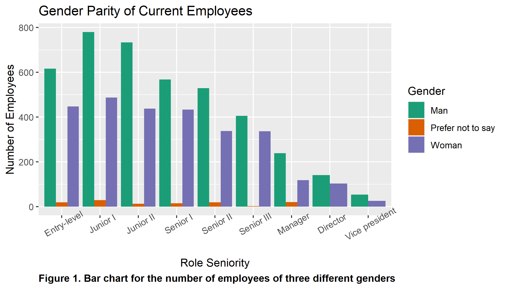

```{r, message = FALSE, echo=FALSE}
library(tidyverse)
# Run `install.packages("kableExtra")`, install.packages("gtsummary"), install.packages('huxtable') and install.packages("broom.mixed") if needed
library(huxtable)
library(kableExtra)
library(gtsummary)
library(lme4)
# this should supress all code and messages
knitr::opts_chunk$set(echo=FALSE)
```


\newpage
# Executive summary

## Background and Aim
Black Saber Software has been implementing an AI service in its application screening process. The AI system is responsible for rating candidates from a pre-recorded video and assessing both a timed technical coding task and a writing sample that are submitted by the candidates. The final interview in Phase 3 is conducted and scored by people while the final hiring decision is made by the HR team. No data on ethnicity or race is collected, thus the AI system does not take those factors into account. However, the company is interested in knowing whether they may influence the salary of an individual. 

The aim of the present research is to examine factors that contribute to hiring, promotion and salary processes of Black Saber Software and determine whether they are fair. In particular, the hiring pipeline using AI is of most interest. Factors that may be of interest are gpa, gender, number of extracurricular activity, number of previous work experience, presence of cv, presence of cover letter, etc.


## Key findings

## Limitations


\newpage
# Technical report
_This part of the report is much more comprehensive than the executive summary. The audience is statistics/data-minded people, but you should NOT include code or unformatted R output here._


## Introduction

_Provide a brief introduction to your report and outline what the report will cover. This section is valuable for setting scope and expectations. _

### Research questions
_Use bullet points to to describe the research questions you are going to address. Write in full sentences._

\newpage

```{r include = FALSE, fig.show='hide'}
# This chunk provides an example of some things you can do with RMarkdown to make your report creation process easier

# read in the data
current_employees <- read_csv("data/black-saber-current-employees.csv")

# create a visualisation
my_plot <- current_employees %>% 
  ggplot(aes(x = productivity)) +
  geom_histogram(colour = "grey", fill = "#6C3082") +
  theme_minimal() +
  labs(title = "Look! A title. But do you want a title or a caption for your report?", x = "This is a changed x label")

# save your plot in your images folder, you can specify the height and width, too
# saving this means you can add the image to your exectuve summary without having to run or rerun the code, if you wish
ggsave("images/example.png", width = 7, height = 4)

# notice how the image is included with the  below
```


```{r, warning=FALSE}
gender_to_currentroles <- select(current_employees, gender, role_seniority) 
hierarchy <- c('Entry-level','Junior I','Junior II','Senior I','Senior II','Senior III','Manager', 'Director','Vice president')
#creating visual to display reported gender ratios of current employees
gender_to_currentroles%>%
  gather(gender,role_seniority)%>%
  mutate(roles = factor(role_seniority))%>%
  ggplot(aes(roles,fill=gender))+
  geom_bar(preserve="single",position="dodge")+
  scale_fill_brewer(palette="Dark2") +
  scale_x_discrete(limits = hierarchy) +
  theme(axis.text.x = element_text(angle=30))+
  labs(title = "Gender Parity of Current Employees",fill="Gender", caption = "Figure 1. Bar chart for the number of employees of three different genders")+
  xlab("Role Seniority")+
  ylab("Number of Employees")+
  theme(plot.caption = element_text(hjust = 0, size = 10, 
                                    face = "bold"))
ggsave("images/currentgender.png", width = 7, height = 4)
```


```{r wrangle_employee_data, message = FALSE}
current_employees <- current_employees
```

## Hiring Question: Fairness of the AI Recruitment Pipeline Manager

The company Black Saber has a new AI recruitment pipeline manager that has been trialing for the Data and Software teams. The board has concerns about the process and questions whether or not it is fair and based on value and talent of each applicant. We have been given the data for each phase of the process, in which there are a total of three. Through each phase there is certain data collected through question and tasks in which the AI uses to narrow down the field of applicants from one phase to another. We want to determine what factors play a major role in being hired through Black Saber's recruitment pipeline manager.

```{r wrangle_application_data, message = FALSE}
phase1_applicants <- read_csv("data/phase1-new-grad-applicants-2020.csv")
phase2_applicants <- read_csv("data/phase2-new-grad-applicants-2020.csv")
phase3_applicants <- read_csv("data/phase3-new-grad-applicants-2020.csv")
final_hires <- read_csv("data/final-hires-newgrad_2020.csv")

# Adds Applicant Info to Phase 3
phase3_applicants <- phase3_applicants %>%
  left_join(phase2_applicants, by = "applicant_id")
# Adds Applicant Info to Final Hires
final_hires <- final_hires %>%  
  left_join(phase3_applicants, by = "applicant_id")
```

### (Phase 1) Defining Features of the Application Form

The first phase of the hiring pipeline is the submission of an application form, cover letter and CV. Each line of `phase1-new-grad-applicants-2020.csv` contains the information of each applicant in phase 1:

* `applicant_id` = A unique ID given to each applicant in Phase 1
* `team_applied_for` = Software or Data
* `cover_letter` = 1 if present, 0 if not.
* `cv` = 1 if present, 0 if not
* `gpa` = 0.0 to 4.0
* `gender` = 'Man', 'Woman', or 'Prefer not to say' as the only options
* `extracurriculars` = 0, 1 or 2. Description in which is accessed automatically by keywords where 2 indicates high, 1 indicates some and 0 indicates no relevant skill building extracurriculars.
* `work_experience` = 0, 1 or 2. Description in which is accessed automatically by keywords where 2 indicates high, 1 indicates some and 0 indicates no relevant work experiences.

```{r}
phase1_applicants[1:5,] %>% 
  kbl(caption = "The first five applicants from phase 1 of the hiring pipeline", booktabs = T) %>% 
  kable_styling(bootstrap_options = c("striped", "hover", "condensed"), full_width = FALSE, position = "left", latex_options = "hold_position") %>% 
  row_spec(0, angle = 45)

```

Similarly, we are also given the list of applicants who have made it to phase 2 along with the factors assessed in phase 2. However, in this section we are only interested in which applicants made it to phase 2. For this reason we will create a variable called `passed_1` and set it to 1, if the applicant made it from phase 1 to phase 2 and 0, if not. This will be the response variable we are interested in for developing our model. The other variables will be fixed effects besides `team_applied_for`. We believe that `team_applied_for` should be added as a random effect because each team has a different set of required skills and/or experiences. Other than that, since each row corresponds to a unique applicant, this suggests that the observations are independent, hence our assumptions are not violated. We want to determine which is the most impactful component of the application form that allows the applicants to proceed to phase 2 of the hiring process.

```{r}
phase1_applicants <- phase1_applicants %>% 
  mutate(passed_1 = as.integer(applicant_id %in% phase2_applicants$applicant_id)) 
```

Given the binomial response variable and random effect, we will be constructing a generalized linear mixed model. Before constructing the model, we want to first consider the gender distribution for those who passed phase 1 and those who did not. In addition, consider also the marginal probabilities and odd ratios.

```{r}
table_gender_passsed <- table(phase1_applicants$gender, phase1_applicants$passed_1)

table_gender_passsed %>% 
  kbl(col.names = c("Did Not Pass Phase 1", "Passed Phase 1"),caption = "The number of applicants that passed phase 1 based on gender", booktabs = T) %>% 
  kable_styling(bootstrap_options = c("striped", "hover", "condensed"), full_width = FALSE, position = "left", latex_options = "hold_position")

prop.table(table_gender_passsed, margin = 2) %>% 
  kbl(col.names = c("Did Not Pass Phase 1", "Passed Phase 1"),caption = "The probability of an applicant's gender given that they pass phase 1", booktabs = T) %>% 
  kable_styling(bootstrap_options = c("striped", "hover", "condensed"), full_width = FALSE, position = "left", latex_options = "hold_position")

table_mw_passed <- table_gender_passsed[-2,]
odds_mw_passes <- (table_mw_passed[2,2]/table_mw_passed[2,1])/(table_mw_passed[1,2]/table_mw_passed[1,1]) 
```

Hence from the table above, given that the applicant passes phase 1, the probability that their gender is a 'Man' is 48%, whereas a 'Woman' is 51%. Also, the odds ratio of Woman vs Man who pass phase 1 is approximately 0.96. That is, the odds of a 'Woman' passing phase 1 is less than that of a 'Man'. This odds ratio is relatively close to 1, hence there is no reason to suspect that there are any gender biases in those who passed phase 1. 

Then, based on the response variable and random effect we will be considering a generalized linear mixed model. \newline

```{r message=FALSE, warning=FALSE, results='hide'}
p1_model_full <- lme4::glmer(passed_1 ~ cover_letter + cv + gpa + gender + extracurriculars + work_experience + (1|team_applied_for), family = binomial(link="logit"), data = phase1_applicants)
```

```{r message=FALSE, warning=FALSE}
tbl_regression(p1_model_full) %>% 
  as_hux_table() %>%
  set_caption("Generalized linear mixed model of applicants who passed Phase 1") %>% 
  set_position("center") %>% 
  set_top_padding(0.5) %>% 
  set_bottom_padding(0.5)
```

It is evident that `gpa`, `extracurriculars` and `work_experience` have the most significant effect on passing Phase 1, based on their log odds. We cannot interpret the odds ratio of `gpa` because their is no one with a 0.0 GPA, however we can interpret the odds ratio of `extracurriculars` and `work_experience` to an extent. Since `extracurriculars` and `work_experience` are given scores of either 0, 1 or 2, the odds ratio is an average of scores 1 and 2. Nonetheless, we find that the the odds of passing Phase 1 with some to high relevant skills from extracurriculars is 21267.4 times that of those without and the odds of passing Phase 1 with some to high relevant work experience is 107591 times that of those without. Overall, we can conclude that the most impactful component of the application form that allows the applicants to proceed to phase 2 of the hiring process in order of is `gpa`, followed by `extracurriculars` and `work_experience`.

### (Phase 2) AI Grading Influences

The second phase of the hiring pipeline invites applicants to do a timed technical coding task, writing sample and submit a pre-recorded video. Each line of `phase2-new-grad-applicants-2020.csv` contains the AI graded scores for skills relevant to each task:

* `applicant_id` = A unique ID given to each applicant in Phase 1
* `technical_skills` = AI graded score from 0 to 100 for the timed technical task
* `writing_skills` = AI graded score from 0 to 100 for the timed writing task
* `speaking_skills` = AI graded rating from 0 to 10 for the speaking ability in the pre-recorded video
* `leadership_presence` = AI graded rating from 0 to 10 for 'leadership presence' in the pre-recorded video

In this phase, we are interested in what factors from the application form affect the AI scoring/rating of technical, writing, and speaking skills and leadership presence. Thus we will be using the data from `phase1-new-grad-applicants-2020.csv`, which has been explained in the previous section. We will have 4 models with the response variables being `technical_skills`, `writing_skills`, `speaking_skills` and `leadership_presence`. For the fixed effects and random effects, we will be using the exact same found in the final model presented for phase 1 except for `cover_letter` and `cv`. The reason for not including `cover_letter` and `cv` is because only those who had submitted both a cover letter and CV made it to phase 2. Based on the response variables, we will be using a linear mixed model for each.

```{r message=FALSE, warning=FALSE}
p2_model_tech <- lmer(technical_skills ~ gpa + gender + extracurriculars + work_experience + (1|team_applied_for), data = phase2_applicants)

p2_model_write <- lmer(writing_skills ~ gpa + gender + extracurriculars + work_experience + (1|team_applied_for), data = phase2_applicants)

p2_model_speak <- lmer(speaking_skills ~ gpa + gender + extracurriculars + work_experience + (1|team_applied_for), data = phase2_applicants)

p2_model_lead <- lmer(leadership_presence ~ gpa + gender + extracurriculars + work_experience + (1|team_applied_for), data = phase2_applicants)
```

```{r message=FALSE, warning=FALSE}
tbl_regression(p2_model_tech) %>% 
  as_hux_table() %>%
  set_caption("Linear mixed model of the Technical Skills Score") %>% 
  set_position("center") %>% 
  set_top_padding(0.5) %>% 
  set_bottom_padding(0.5)
```

From the linear mixed model of the Technical Skill Score, it follows that the most influential fixed effect is `gpa` followed by `extracurriculars`. Moreover, each 1.0 in `gpa` increases the score by 8.8 on average. As for `extracurriculars`, those with some relevant skills from extracurriculars have a higher score than those who do not by an average of 4.6 and doubled for those with high relevant skills. We also notice that those who put 'Prefer not to say' for their gender have higher score than those who put 'Man' by an average of 23. This is not concerning because the sample of those who put 'Prefer not to say' is very small and thus can be seen as outliers to the overall average. Besides that, those who put 'Woman' for their gender only have a higher score than those who put 'Man' by an average of 1. \newpage 

```{r message=FALSE, warning=FALSE}
tbl_regression(p2_model_write) %>% 
  as_hux_table() %>%
  set_caption("Linear mixed model of the Writing Skills Score") %>% 
  set_position("center") %>% 
  set_top_padding(0.5) %>% 
  set_bottom_padding(0.5)
```

The linear mixed model of the Writing Skill Score shows similar results to the one for the Technical Skill Score with the most influential fixed effect being `gpa`. Each 1.0 in `gpa` here increases the score by 9.9 on average. Unlike the Technical Skill Score, the second most influential fixed effect for the of the Writing Skill Score is `work_experience`. Those with some relevant work experience have a higher score than those who do not by an average of 4.1 and doubled for those with high relevant experiences. We also find that those who put 'Woman' for their gender only have a higher score than those who put 'Man' by an average of 3.8.

```{r message=FALSE, warning=FALSE}
tbl_regression(p2_model_speak) %>% 
  as_hux_table() %>%
  set_caption("Linear mixed model of the Speaking Skills Rating") %>% 
  set_position("center") %>% 
  set_top_padding(0.5) %>% 
  set_bottom_padding(0.5)
```

The linear mixed model of the Speaking Skills Rating is significantly different from the previous models. The model shows that the most influential factor of the rating is `work_experience`. More specifically, those with some relevant work experience have a higher rating than those who do not by an average of 0.93 and doubled for those with high relevant experiences. The second most influential factor of the rating is `extracurriculars`, showing a higher rating on average of 0.47 for those who have relevant skills from extracurriculars compared to those who do not and doubled for those with high relevant skills. Surprisingly, there is a negative coefficient for `gpa`, showing that those with higher GPAs have a lower rating on average. We also see a negative coefficient for those who put 'Woman' for their gender as they have a lower rating compared to those who put 'Man' by an average of 1.8.

```{r message=FALSE, warning=FALSE}
tbl_regression(p2_model_lead) %>% 
  as_hux_table() %>%
  set_caption("Linear mixed model of the Leadership Presence Rating") %>% 
  set_position("center") %>% 
  set_top_padding(0.5) %>% 
  set_bottom_padding(0.5)
```

The linear mixed model of the Leadership Presence Rating shows that the most influential factor is no other than `extracurriculars`. This is followed by `gpa` and then `work_wxperience`. By interpreting the coefficients of `extracurriculars` and `work_wxperience`, we find that those who have some of the relevant skills for each, compared to those who do not, have a higher rating on average of 0.76 and 0.16, respectively, and doubled if they have higher relevant skills and/or experiences. As for `gpa`, each 1.0 in `gpa` here increases the score by an average of 0.22. Similar to the Speaking Skills Rating, we also see a negative coefficient for those who put 'Woman' for their gender as they have a lower rating compared to those who put 'Man' by an average of 0.91.

After analyzing all of the possible factors that can affect the scores and rating given by the AI. we conclude that the top most influential factors are no other than `gpa`, `extracurriculars` and `work_experience`. We also find that those who put 'Woman' as their gender, score higher than those who put 'Man' on average for the Technical and Writing Task. On the other hand, those who put 'Man' as their gender, were rated higher than those who put 'Woman' on average for the Speaking Skills and Leadership Presence. Ultimately the differences between the genders are small relative to the other factors, hence there is no concern about bias in gender parity for the AI scores and ratings.

<<<<<<< HEAD
### (Phase 3) Human Rating Differences

The third phase of the hiring pipeline is the final interview. Each line of \newline
`phase3-new-grad-applicants-2020.csv` contains the overall job fit rating given by the interviewers:

* `applicant_id` = A unique ID given to each applicant in Phase 1
* `interviewer_rating_1` = First interviewer's rating from 0 to 100 for overall job fit
* `interviewer_rating_2` = Second interviewer's rating from 0 to 100 for overall job fit

In this phase, we are interested in what factors from the application form and the AI scoring/rating affect the overall job rating given by each interviewer. Thus we will be using the data from `phase1-new-grad-applicants-2020.csv` and `phase2-new-grad-applicants-2020.csv`, which has been explained in the previous sections. We will have 2 models with the response variables being `interviewer_rating_1` and `interviewer_rating_2`. For the fixed effects and random effects, we will be using the exact same found in the models presented for phase 2 with the inclusion of the 4 variables which were the response variables. That is, `technical_skills`, `writing_skills`, `speaking_skills` and `leadership_presence` will be added as fixed effects. We will also multiply the `speaking_skills` and `leadership_presence` ratings by 10, so that they are on the same scale as the `technical_skills` and `writing_skills` score. Based on the response variables, the model will be similar to that of phase 2, hence we will be using a linear mixed model for each. 

```{r}
phase3_applicants <- phase3_applicants %>% 
  mutate(speaking_skills = speaking_skills*10) %>% 
  mutate(leadership_presence = leadership_presence*10)
```

```{r message=FALSE, warning=FALSE}
p3_model_int1 <- lmer(interviewer_rating_1 ~ gpa + gender + extracurriculars + work_experience + technical_skills + writing_skills + speaking_skills + leadership_presence + (1|team_applied_for), data = phase3_applicants)

p3_model_int2  <- lmer(interviewer_rating_2 ~ gpa + gender + extracurriculars + work_experience + technical_skills + writing_skills + speaking_skills + leadership_presence + (1|team_applied_for), data = phase3_applicants)
```

```{r message=FALSE, warning=FALSE}
tbl_regression(p3_model_int1) %>% 
  as_hux_table() %>%
  set_caption("Linear mixed model of Interviewer 1's Overall Job Ratings") %>% 
  set_position("center") %>% 
  set_top_padding(0.5) %>% 
  set_bottom_padding(0.5)

```

Looking at the model for the ratings given by Interviewer 1, we only need to look at each coefficient relative to each other. It is evident that the least influential factor is in fact gender. It is seen that on average, those of the gender 'Women' have a score that is 0.24 higher than that of those who are the gender 'Man'. \newline 

```{r message=FALSE, warning=FALSE}
tbl_regression(p3_model_int2) %>% 
  as_hux_table() %>%
  set_caption("Linear mixed model of Interviewer 2's Overall Job Ratings") %>% 
  set_position("center") %>% 
  set_top_padding(0.5) %>% 
  set_bottom_padding(0.5) 
```

The same results are evident in the ratings given by Interviewer 2. In fact, the result is most apparent here where on average, those of the gender 'Women' have a score that is only 0.02 higher than that of those who are the gender 'Man'. The only concerning thing here is that on average, those with higher GPA and/or more relevant work experience have a lower rating for `interviewer_rating_2`. Since being listed as 'first' or 'second' interviewer is arbitrary, there only reason for this is possibly outliers in the data. 

All in all, there are no strong evidence that suggest applicants are not judged on their talents and value to the company.

### (Final Hires) The Cost of the Job Offer

Since there are only three phases of the recruitment pipeline, in this section we will be looking at those who were sent an offer letter. Each line of `data/final-hires-newgrad_2020.csv` contains the unique IDs of those who were sent an offer letter at the end of the recruitment pipeline. We are only interested in which applicants got an offer letter after phase 3. For this reason we will create a variable called `offered` and set it to 1, if the applicant got an offer letter after phase 3 and 0, if not. This will be the response variable we are interested in for developing our model. As for the fixed effects, we will be using `gender`and interview ratings, `interviewer_rating_1` and `interviewer_rating_2`. The reason for only using the interview ratings is because we find that the interview rating encompasses all of the data collected from each applicant from phases 1 and 2. Furthermore, the interview is usually the make or break situation for the applicants to prove themselves to the employer that they are worthy of a job offer. Then similar to the previous models, we will add `team_applied_for` as a random effect.

```{r}
phase3_applicants <- phase3_applicants %>% 
  mutate(offered = as.integer(applicant_id %in% final_hires$applicant_id)) 
```

Analogous to the analysis in phase 1, we will be constructing a generalized linear mixed model, but before that we want to first consider the gender distribution for those who got an offered letter to those who did not. In addition, consider also the marginal probabilities and odd ratios.

```{r}
table_gender_offered <- table(phase3_applicants$gender, phase3_applicants$offered)

table_gender_offered %>% 
  kbl(col.names = c("Did not get an offer letter", "Got an offer letter"),caption = "The number of applicants that got an offer letter based on gender", booktabs = T) %>% 
  kable_styling(bootstrap_options = c("striped", "hover", "condensed"), full_width = FALSE, position = "left", latex_options = "hold_position")

prop.table(table_gender_offered, margin = 2) %>% 
  kbl(col.names = c("Did not get an offer letter", "Got an offer letter"),caption = "The probability of an applicant's gender given that they got an offer letter", booktabs = T) %>% 
  kable_styling(bootstrap_options = c("striped", "hover", "condensed"), full_width = FALSE, position = "left", latex_options = "hold_position")

prop.table(table_gender_offered, margin = 1) %>% 
  kbl(col.names = c("Did not get an offer letter", "Got an offer letter"),caption = "The probability of an applicant getting an offer letter given gender", booktabs = T) %>% 
  kable_styling(bootstrap_options = c("striped", "hover", "condensed"), full_width = FALSE, position = "left", latex_options = "hold_position")

odds_mw_offered <- (table_gender_offered[2,2]/table_gender_offered[2,1])/(table_gender_offered[1,2]/table_gender_offered[1,1]) 
```

Hence from the table above, given that the applicant got an offer letter, the probability that their gender is a 'Man' is 80%, whereas a 'Woman' is 20%. We also see that the probability of getting an offer letter for an applicant whose gender is 'Man' is 53%, whereas a 'Woman' is 29%. Also, the odds ratio of Woman vs Man who pass phase 1 is approximately 0.35. That is, the odds of a 'Woman' passing phase 1 is less than that of a 'Man'. This odds ratio is relatively close to 0, hence there is reason to suspect that there are possible gender biases in those who received an offer letter. That is, if we have not taken a look at the bigger picture. Thus lets now look at the model and see if there is possible bias between those who received and not received an offer letter. \newpage

```{r message=FALSE, warning=FALSE, results='hide'}
final_model_full <- lme4::glmer(offered ~ gender + interviewer_rating_1 + interviewer_rating_2 + (1|team_applied_for), family = binomial(link="logit"), nAGQ=0, data = phase3_applicants)
```

```{r message=FALSE, warning=FALSE}
tbl_regression(final_model_full) %>% 
  as_hux_table() %>%
  set_caption("Generalized linear mixed model of applicants who got an offer") %>% 
  set_position("center") %>% 
  set_top_padding(0.1) %>% 
  set_bottom_padding(0.1)
```

From the model above, we can see that the coefficients and p-values are absurdly large, however it is still useful to interpret. We see that the coefficient of 'Women' is negative, where as `interviewer_rating_1` and `interviewer_rating_2` are positive. The odds of the `gender`, 'Women' are essentially 0 compared to 'Man', due to the fact that a majority of those who got offer letters are of the `gender`, 'Man'. However, this does not change the fact that the overall job fit ratings from the interview increases the odds of getting an offer letter significantly. This is knowing that `interviewer_rating_1` and `interviewer_rating_2` are unbiased bases on the analysis in the previous section. Hence it is to say that those who got an offer letter, got one because they were well suited for the position.   

## Promotion Question: Fairness of Promotion process

Black Saber aims to promote an equitable and inclusive work environment based on merit. The board wants to assure that its promotion processes are not only fair, but strictly based on talent to the company. We have been given the data for the company's current employees and their key performance indicators throughout their time at the company marked by financial quarters. We wish to determine which factors contribute to employees moving up the ranks of Black Saber seniority.

### Features Recorded of Black Saber's Current Employees

While employed at Black Saber Software, employee performance indicators are recorded every financial quarter. Each line of `black-saber-current-employees.csv` contains the information of each employee at the financial quarters they were employed:

* `employee_id` = A unique ID given to each employee of Black Saber
* `gender` = 'Man', 'Woman', or 'Prefer not to say' as the only options
* `team` = Divisions of Black Saber staff categorized into: "Software", "People and talent", "Operations", "Marketing and sales", "Legal and financial", "Design", "Data", and "Client services".
* `financial_q` = Financial quarter where following features were recorded.
* `role_seniority` = Hierarchy of employees within each team. Rank order from least senior to most senior: 'Entry-level','Junior I','Junior II','Senior I','Senior II','Senior III','Manager', 'Director','Vice president'. 
* `leadership_for_level` = Quality of demonstrated leadership, taking into account role level. (i.e. “Appropriate for level” requires much less for entry-level employees than for a manager). Categorized into "Needs Improvement", "Appropriate for Level", and "Exceeds Expectations".
* `productivity` = Work output in relation to job description, rated on a 0-100 scale with 50 being satisfactory and above 50 indicating better than expected productivity.
* `salary` = Salary at at the given financial quarter (note: these are effective yearly values for the current wage, but don’t take in to account previous salary steps in the same year, etc.)

```{r five_current_employees}
sample_n(distinct(current_employees, employee_id, .keep_all = TRUE), 5) %>% 
  kbl(caption = "Five Anonymous Employees at Black Saber Software", booktabs = T) %>% 
  kable_styling(bootstrap_options = c("striped", "hover", "condensed"), full_width = TRUE, position = "left", latex_options = "hold_position") %>% 
  row_spec(0, angle = 45)

```

For this question, we are interested in how many promotions an employee received while working at Black Saber Software. For this reason, we will create a variable called `number_of_promotions` counting the change in role_seniority of each employee. 
This will be the response variable we are interested in for developing our model. 

The other variables will be fixed effects besides `team_applied_for`. We believe that `team_applied_for` should be added as a random effect because each team has a different set of required skills and/or experiences. Other than that, since each row corresponds to a unique applicant, this suggests that the observations are independent, hence our assumptions are not violated. We want to determine which is the most impactful component of the application form that allows the applicants to proceed to phase 2 of the hiring process. 

```{r promotion_data, message = FALSE}
promoted_employees <- read.csv("data/black-saber-current-employees.csv")  %>% 
    arrange(employee_id, financial_q) %>% 
    group_by(employee_id) %>% 
    mutate(number_of_promotions = max(length(unique(role_seniority)))-1) %>% 
    group_by(employee_id) %>%
    mutate(quarters_since_hiring = n()) %>% 
    mutate(promotions_per_quarter = number_of_promotions/(quarters_since_hiring)) %>% 
    group_by(employee_id) %>% 
    mutate(starting_role_seniority = first(role_seniority)) %>% 
    add_count(employee_id, leadership_for_level) %>%
    mutate(avg_leadership = leadership_for_level[n == max(n)][1]) %>%
    mutate(avg_productivity = round(mean(productivity), digits = 2)) %>%
    select(-n)

tmp_var <- current_employees  %>% group_by(employee_id, role_seniority) %>% slice(n()) %>% arrange(employee_id, financial_q)
number_of_promotions_vec <- c(0)
for (i in 2:nrow(tmp_var)){
  if(tmp_var$employee_id[i] == tmp_var$employee_id[i-1]){
    number_of_promotions_vec[i] = number_of_promotions_vec[i-1] + 1
  } else {
    number_of_promotions_vec[i] = 0
  }
}
# number_of_promotions_vec

pmfd <- current_employees %>%
  group_by(employee_id, role_seniority) %>% 
  mutate(avg_productivity = round(mean(productivity), digits = 2)) %>%
  transform(leadership_for_level=as.numeric(factor(leadership_for_level,  levels = c("Needs improvement", "Appropriate for level", "Exceeds expectations")))) %>% 
  group_by(employee_id, role_seniority) %>% 
  mutate(avg_leadership_level = round(mean(leadership_for_level), digits = 2)) %>% 
  select(-c(leadership_for_level, productivity, salary)) %>% 
  group_by(employee_id, role_seniority) %>% 
  mutate(quarters_since_hiring = n()) %>% 
  group_by(employee_id, role_seniority) %>% 
  slice(n()) %>% 
  arrange(employee_id, financial_q)

pmfd$number_of_promotions = number_of_promotions_vec
pmfd <- pmfd %>% group_by(employee_id, role_seniority) %>% 
  mutate(promotions_per_quarter = number_of_promotions/(quarters_since_hiring))

```

Given the response variable is a count we will be consider a Poisson Regression model. Before constructing the model, we want to first consider the gender distribution in number of promotions of current employees. In addition, consider also the joint probabilities.\newpage

```{r gender_to_promotion}
# Promoted_employees_dist takes only the most recent role seniority, and tracks average of all features and initial position.
promoted_employees_dist <- promoted_employees %>%
  slice(n())


ggplot(promoted_employees_dist, aes(number_of_promotions)) + 
  geom_bar(aes(fill = gender), position = "fill") + 
  scale_fill_brewer(palette="Dark2") +
  geom_hline(yintercept = 0.5) +
  labs(title = "Gender Parity in Number of Promotions of Current Employees",fill="Gender", caption = "Figure 2. Gender distribution in the number of promotions of employees. \nThe line in the middle assumes equal proportion of promotions \nin both genders.")+
  xlab("Number of Promotions") +
  ylab("Proportion of Employees by Gender") +
  theme(plot.caption = element_text(hjust = 0, size = 10, face = "bold"))


ggsave("images/currentgender_promotion.png", width = 7, height = 4)
```


```{r gender_to_quarters, warning=FALSE, message = FALSE}
# Promoted_employees_dist takes only the most recent role seniority, and tracks average of all features and initial position.

gender_to_quarters <- select(promoted_employees_dist, gender, quarters_since_hiring) 
#creating visual to display  reported gender ratios of current employees
gender_to_quarters%>%
  ggplot(aes(quarters_since_hiring,fill=gender))+
  geom_bar(preserve="single",position="dodge")+
  scale_fill_brewer(palette="Dark2") +
  theme(axis.text.x = element_text(angle=30))+
  labs(title = "Gender Parity in Number of Quarters Worked of Current Employees",fill="Gender", caption = "Figure 3. ")+
  xlab("Number of Quarters") +
  ylab("Number of Employees") +
  theme(plot.caption = element_text(hjust = 0, size = 10, face = "bold"))
# ggsave("images/currentgender_promotion.png", width = 7, height = 4)
```
```{r gender_to_positions, warning=FALSE, message = FALSE}
# Promoted_employees_dist takes only the most recent role seniority, and tracks average of all features and initial position.
hierarchy <- c('Entry-level','Junior I','Junior II','Senior I','Senior II','Senior III','Manager', 'Director','Vice president')

gender_to_positions <- select(promoted_employees_dist, gender, starting_role_seniority) 
#creating visual to display  reported gender ratios of current employees
gender_to_positions%>%
  ggplot(aes(starting_role_seniority,fill=gender))+
  geom_bar(preserve="single",position="dodge")+
  scale_fill_brewer(palette="Dark2")+
  theme(axis.text.x = element_text(angle=30))+
  scale_x_discrete(limits = hierarchy) + 
  labs(title = "Gender Parity in Starting Roles of Current Employees",fill="Gender", caption = "Figure 4.")+
  xlab("Starting Positions") +
  ylab("Number of Employees") + 
  theme(plot.caption = element_text(hjust = 0, size = 10, face = "bold"))
# ggsave("images/currentgender_promotion.png", width = 7, height = 4)
```


```{r promo_prob}
table_gender_promotion <- table(promoted_employees_dist$gender, promoted_employees_dist$number_of_promotions)
table_gender_promotion %>% 
  kbl(caption = "The number of employee promotions based on gender", booktabs = T) %>% 
  kable_styling(bootstrap_options = c("striped", "hover", "condensed"), full_width = FALSE, position = "left", latex_options = "hold_position")

prop.table(table_gender_promotion, margin = 2) %>% 
  kbl(caption = "The probability of an employee's gender given number of promotions", booktabs = T) %>% 
  kable_styling(bootstrap_options = c("striped", "hover", "condensed"), full_width = FALSE, position = "left", latex_options = "hold_position")
```

From the tables above, the only time the probability of an employee being a woman is higher is given the employee has not had any promotions. Conversely, seeing that given a higher number of promotions, the probability of being a man becomes proportionally larger, a gender bias may be suspected however we will withold any conclusions until we consider our model.

```{r message=FALSE, warning=FALSE}
# pm_1 <- lme4::glmer(number_of_promotions ~ 1 + gender + (1 | employee_id), data = promoted_employees, family = poisson(link = "log"), nAGQ = 100)
# summary(pm_1)
# 
# promo_model <- glm(number_of_promotions ~ gender + avg_leadership + avg_productivity, family = poisson, offset = log(quarters_since_hiring), data = promoted_employees_dist)

# tbl_regression(promo_model1) %>% 
#   as_hux_table() %>%
#   set_caption("Generalized linear model of employee promotions") %>% 
#   set_position("center") %>% 
#   set_top_padding(0.5) %>% 
#   set_bottom_padding(0.5)

promo_model0 <- lme4::lmer(promotions_per_quarter ~ (1|team) + (1|role_seniority), data = pmfd)
promo_model1 <- lme4::lmer(promotions_per_quarter ~ gender + (1|team) + (1|role_seniority), data = pmfd)
promo_model2 <- lme4::lmer(promotions_per_quarter ~ gender + avg_productivity + (1|team) + (1|role_seniority), data = pmfd)
promo_model3 <- lme4::lmer(promotions_per_quarter ~ gender + avg_productivity + avg_leadership_level + (1|team) + (1|role_seniority), data = pmfd)

# tbl_regression(promo_model2) %>% 
#   as_hux_table() %>%
#   set_caption("Generalized linear model of employee promotions") %>% 
#   set_position("left") %>% 
#   set_top_padding(0.5) %>% 
#   set_bottom_padding(0.5)

lmtest::lrtest(promo_model0, promo_model1)
lmtest::lrtest(promo_model2, promo_model3)
lmtest::lrtest(promo_model0, promo_model3)

# promo_model3
```

## Salary Question: Fairness of Salary assignment for current employees at Black Saber

Along with the fairness of their promotion practices, the Black Saber board members also want to know that compensation of employees is set by the same standards of merit. Using the same dataset of Black Saber's current employees, we wish to determine which factors contribute to setting employee salaries.

 Information of each employee at the financial quarters they were employed will be utilized again from `black-saber-current-employees.csv`.
 
 In this section, we are interested in the fairness of salary assignment for current employees at Black Saber. We will be looking how `role_seniority`, `leadership_for_level`,`productivity`, and `gender` affect salary assignment.
 
```{r wrangle_salary_data}
# In form where each row contributes to a different role seniority and salary at the time. leadership and productivity are averaged for length of time in each role.
salary_employees <- current_employees %>%
  arrange(employee_id, financial_q) %>% 
  group_by(employee_id, role_seniority) %>% 
  mutate(avg_productivity = round(mean(productivity), digits = 2)) %>%
  transform(salary = as.numeric(gsub('[$,]', '', salary))) %>% 
  transform(leadership_for_level=as.numeric(factor(leadership_for_level,  levels = c("Needs improvement", "Appropriate for level", "Exceeds expectations")))) %>% 
  group_by(employee_id, role_seniority) %>% 
  mutate(avg_leadership_level = round(mean(leadership_for_level), digits = 2)) %>% 
  select(-c(leadership_for_level, productivity)) %>% 
  group_by(employee_id, role_seniority) %>% 
  slice(n())
```
 
First, let's compare gender parity in the salaries of the most recent quarter for every employee.
 
```{r gender_to_salary}
hierarchy <- c('Entry-level','Junior I','Junior II','Senior I','Senior II','Senior III','Manager', 'Director','Vice president')

cur_salary_employees <- salary_employees %>% 
  arrange(employee_id, financial_q) %>% 
  group_by(employee_id) %>% 
  slice(n())

cur_salary_employees %>%
  ggplot(aes(x = role_seniority, y= salary, fill=gender))+
  geom_boxplot() + 
  scale_fill_brewer(palette="Dark2") +
  scale_x_discrete(limits = hierarchy) + 
  labs(title = "Gender Parity in Salaries of Current Employees",fill="Gender", caption = "Figure 5.")+
  xlab("Role") +
  ylab("Salary") +
  theme(plot.caption = element_text(hjust = 0, size = 10, face = "bold"))
```
 
Just by looking at this figure, it seems that within the same roles, males tend to be paid more than their female counterparts. Before we reach any conclusions, let's compare some models.
 
 
```{r play_with_salary_models, message=FALSE}
salary_model0 <- lme4::lmer(salary ~ (1|team) + (1|role_seniority), data = salary_employees)
salary_model1 <- lme4::lmer(salary ~ gender + (1|team) + (1|role_seniority), data = salary_employees)
salary_model2 <- lme4::lmer(salary ~ gender + avg_productivity + (1|team) + (1|role_seniority), data = salary_employees)
salary_model3 <- lme4::lmer(salary ~ gender + avg_productivity + avg_leadership_level + (1|team) + (1|role_seniority), data = salary_employees)

```

```{r include=FALSE}
lmtest::lrtest(salary_model0, salary_model1)
lmtest::lrtest(salary_model2, salary_model3)
lmtest::lrtest(salary_model1, salary_model2)
lmtest::lrtest(salary_model1, salary_model3)
```
The following likelihood test performed across varying linear mixed model indicates that we should use salary_model2. This model which consist of salary as a response variable with `gender`and `avg_productivity` as fixed effects, and `team`, `role_seniority` as random effects. 

```{r}
#salary_model2

tbl_regression(salary_model2) %>% 
  as_hux_table() %>%
  set_caption("Linear mixed model of employee salaries") %>% 
  set_position("center") %>% 
  set_top_padding(0.5) %>% 
  set_bottom_padding(0.5)
```

Taking into account the gender and average productivity of a given current employee while randomly selecting based team and role seniority, we see that women are paid -$1997.94 less than men. We evidently see that there is a lack of fairness within the salary assignment of current employees as women are being paid less.


## Discussion

_In this section you will summarize your findings across all the research questions and discuss the strengths and limitations of your work. It doesn't have to be long, but keep in mind that often people will just skim the intro and the discussion of a document like this, so make sure it is useful as a semi-standalone section (doesn't have to be completely standalone like the executive summary)._

### Strengths and limitations

\newpage
# Consultant information

## Consultant profiles

**Andy Vu**. Andy is a junior consultant with Zeusolutions. He specializes in statistical modeling. Andy earned his Bachelor of Science, Specializing in Mathematics & Its Applications (Probability/Statistics) and Majoring in Statistics from the University of Toronto in 2021. 

**Ethelia Choi**. Ethelia is a junior consultant with Zeusolutions. She specializes in data analytics. Ethelia earned her Bachelor of Science, Majoring in Statistics and Mathematics from the University of Toronto in 2021. 

**James F. Kanu**. James is a junior consultant with Zeusolutions. He specializes in data visualization. James earned his Bachelor of Science, Majoring in Mathematics and Minoring in Computer Science and Statistics from the University of Toronto in 2021.

**Justin Lee**. Justin is a junior consultant with Zeusolutions. He specializes in data analytics. Justin earned his Bachelor of Science, Majoring in Statistics and Mathematics from the University of Toronto in 2021. 

## Code of ethical conduct

Zeusolutions strives to be a forefront in professional statistical work while maintaining the integrity, security and privacy of our customers. We believe in executing our work with proper due diligence and informative research. This is why we believe in the following.

1.	Maintaining the trust of our customers as a vital part of our company’s asset.  
2.	Privacy of our customers is essential in all our statistical work. We do not disclose or seek personal gain from any information given to us by our customers. Any possible interest that can be regarded as influencing the results of our statistical work will be clearly communicated. 
3.	Appropriate security measures and practices take place amongst our employees to ensure sensitive information is kept safe. 
4.	Support for all employees. All statistical work performed with Zeusolutions is appropriately credited to all employees involved. 
5.	Ensure the disclosure of all limitations and assumptions made in relevance to data of any particular work. 

We recognize these importance’s and responsibilities we ought to uphold to our customers. 

